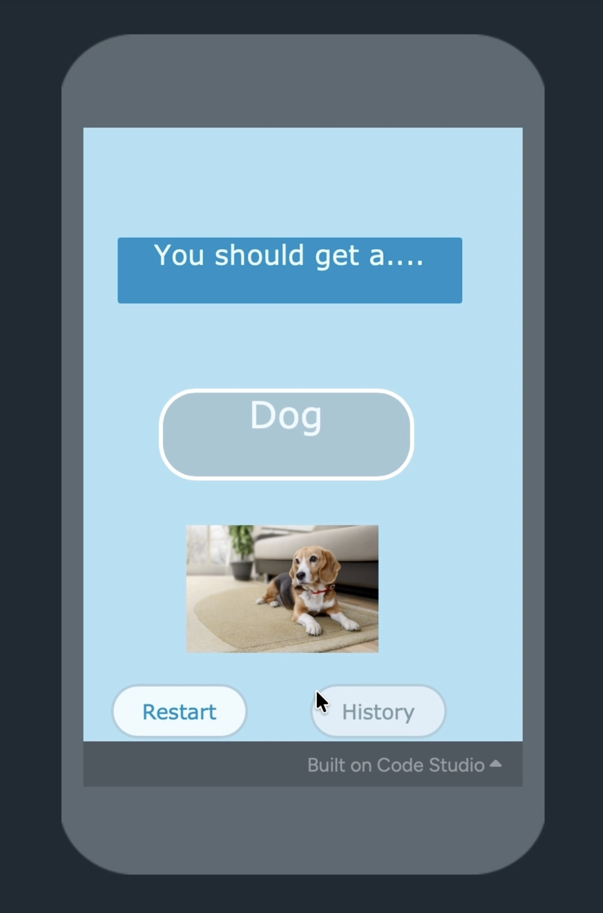
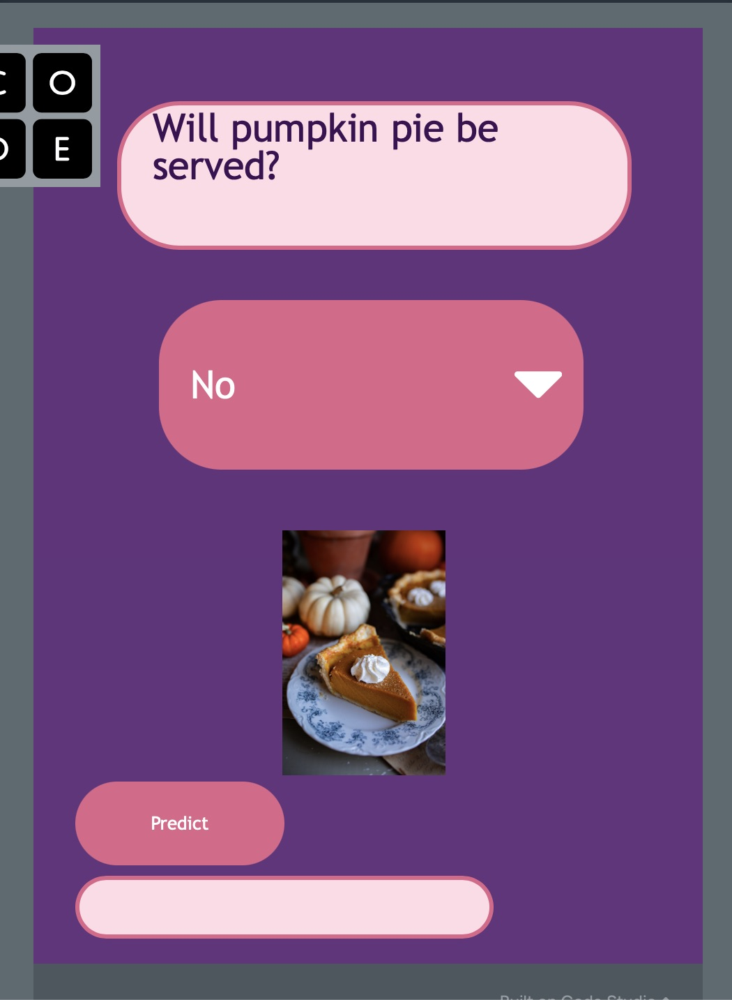
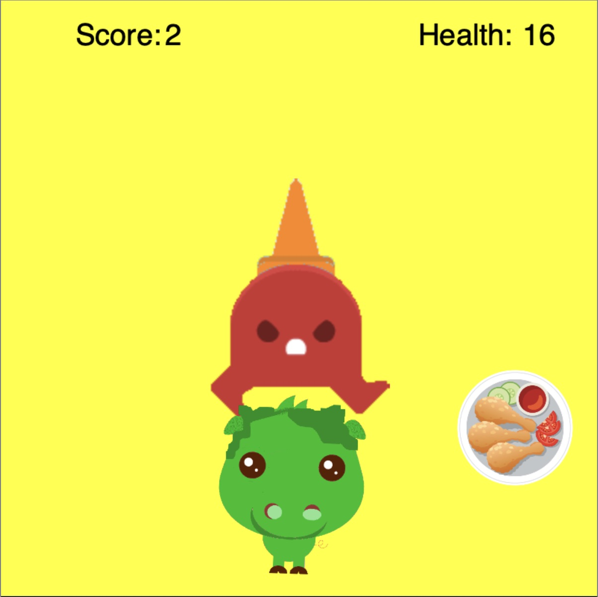

# Portfolio

## Projects
### Dressaway Game
Built an interactive two-stage game focused on sprite interactions, collision mechanics, and responsive player controls. The project features multiple backgrounds, user input systems, non-sprite variables such as health tracking, and more advanced movement logic. One of the main gameplay mechanics involves collision detection using conditional statements and touch-based interactions, allowing the player to bounce off obstacles while losing health.

A challenge during development was balancing movement and collision behavior in the game’s second stage, where players interact with clothing items by clicking them. To solve conflicting movement mechanics, I implemented an `if/else` system combined with sprite position properties to ensure smooth directional controls while maintaining bounce-off collisions.

Through this project, I strengthened my understanding of game design, collision blocks, complex sprite movement, while also learning the significance of user experience, including sprite sizing, positioning, and intuitive controls. Future improvements include adding a start screen and clearer gameplay instructions to guide players through the second section more effectively.
- [DressAway Game](https://studio.code.org/projects/gamelab/8239b43c-1b5f-4b86-bd29-2550f4b3c619)
- 
  
### Pet Decider App
- Developed an interactive pet recommendation app that suggests suitable pets based on the user’s home size, available time, and budget using nested conditional logic. The program displays personalized recommendations with matching text and images while considering realistic pet care needs and lifestyle factors.
The app also includes input validation through helper functions, a recommendation history list built with iteration, duplicate checking to prevent repeated results, and reset/restart features for a smoother user experience. Through this project, I strengthened my understanding of conditional statements, procedures, lists, iteration, input validation, and program organization while improving my ability to design user-friendly applications.
- [Pet Decider App](https://studio.code.org/projects/applab/04740d0a-0e30-4312-8bb1-6bf43aa63074)
- 

### Sweet Potato Pie Decider
- Developed a machine learning–based app that predicts whether sweet potato pie would fit into a Thanksgiving meal based on patterns between traditional side dishes and desserts. The model achieved over 89% accuracy and used existing dataset trends to generate predictions based on user selections.
Through testing and analysis, I identified a major limitation in the dataset: a significant imbalance between “Yes” and “No” responses, causing the model to predict “No” far more frequently despite matching patterns in the positive data. This project strengthened my understanding of AI bias, dataset imbalance, prediction reliability, and the importance of diverse training data in machine learning applications.
Future improvements include retraining the model with more balanced and diverse datasets, potentially using alternative food categories such as apple pie to improve prediction variety, usefulness, user experience, etc.
- [Sweet Potato Pie Decider App](https://studio.code.org/projects/applab/281379ab-cfb8-40da-9d47-d800d418f71e)
- 

### Flappybird Game
- Built a 2D flying-style arcade game featuring sprite-based movement, obstacle interactions, and collectible mechanics. The player controls a flying character using keyboard inputs while navigating gravity-based movement to collect coins and avoid moving obstacles.
The game includes collision detection where obstacles push the player away, a coin system with randomized respawn positions, and boundary-based game-over conditions that challenge player control and precision.
A challenge during development was balancing the gravity and jump mechanics, as the player initially moved too quickly and was difficult to control. Adjusting these values improved responsiveness & made the gameplay more manageable.
Through this project, I strengthened my understanding of sprite physics, conditional statements, user input handling, game design balance, and more.
- [Flappybird Game](https://studio.code.org/projects/gamelab/613ee2e4-28d3-4039-b023-22bcad02530e)
- 

### Sidescroller Game
- Built a 2D arcade-style game featuring sprite movement, collision detection, scoring, and a health system. The player controls an “Angry Bird” character that must avoid obstacles while collecting targets to increase score.
The game includes interactive sprite behaviors where collisions with obstacles reduce health & trigger visual feedback, whereas collecting targets increases score & resets their position. It also features a simple jump mechanic with constrained movement, along with looping obstacles and collectibles that re-enter the screen to allow continuous gameplay.
A key challenge during development was balancing movement mechanics, especially the jump system, to ensure the player could control vertical motion without becoming too difficult or inconsistent. As a result, this helped expand my understanding gameplay balancing.
Through this project, I mostly strengthened my skills in game design, real-time input, and managing multiple game states such as score tracking and game over conditions.
- [Sidescroller Game](https://studio.code.org/projects/gamelab/96be2aff-83ab-4340-888d-477458c7a219)
- 

